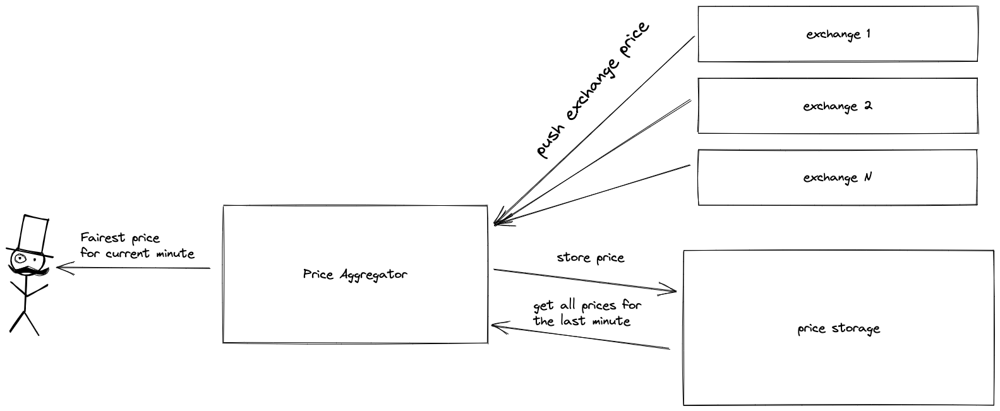

According to [task](task.md) I've developed a solution using Go that subscribes to fake bitcoin exchanges that push current "BTC -> USD" price every 5 seconds and prints ["Fair" price](#fair-price) every minute.

Program output example:
```bash
go run main.go                         
1661014685, 23276.34
1661014745, 23285.18
1661014805, 23294.46
1661014865, 23303.75
1661014925, 23312.93
1661014985, 23322.21
1661015045, 23331.46

```

## Project structure

```
.
└── internal
    ├── exchange -- imitates exchanges that sends current prices
    ├── priceagg -- aggregates prices from exhanges and calculcates current price
    └── storage  -- stores prices in memory
main.go -- entrypoint
```

## Program logic illustration


## "Fair" price
I've decided that just calculating arithmetic mean is not fair enough since within minute prices are updated multiple times. And more recent prices are more relevant and should have more "weight". Because of this [WAM](https://en.wikipedia.org/wiki/Weighted_arithmetic_mean) was chosen.
